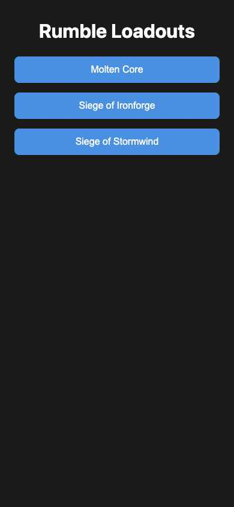
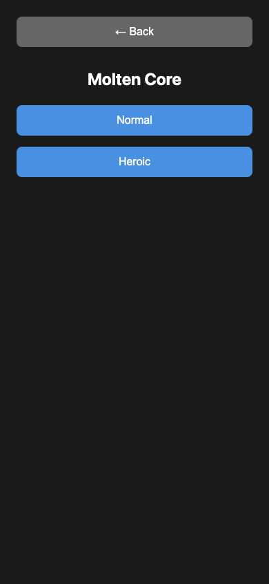
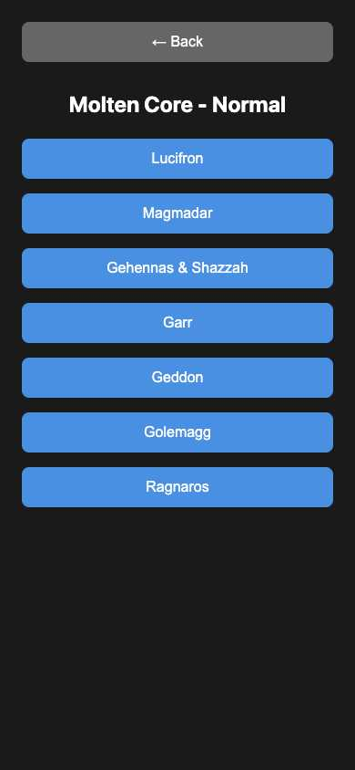
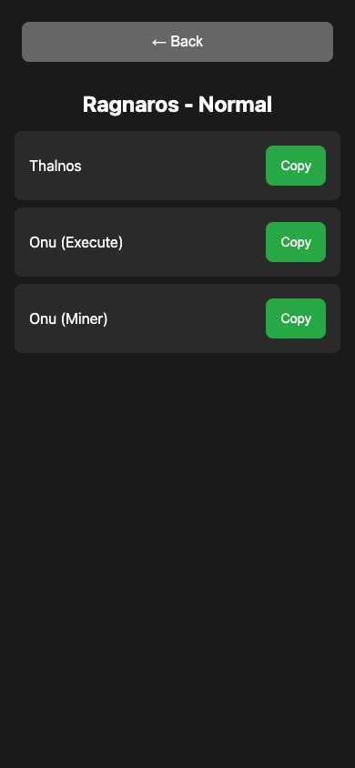

# Rumble Loadouts

[](https://app.netlify.com/projects/rumble-loadouts/deploys)

Mobile-first web app for looking up and copying team loadouts for Rumble raids.

🚀 **Live App:** https://rumble-loadouts.netlify.app/

## Features

- Browse loadouts by raid (Molten Core, Ironforge, Horde Event)
- Filter by difficulty (Normal/Heroic)
- One-click copy to clipboard
- Mobile-optimized interface
- Offline functionality with Service Worker

## Screenshots

<div align="center">

### Mobile Interface



*Main screen with raid selection*



*Difficulty selection (Normal/Heroic)*



*Boss selection screen*



*Team loadouts with one-click copy*

</div>

## Development

```bash
./build_project.sh
```

Built with Elm and deployed on Netlify.
